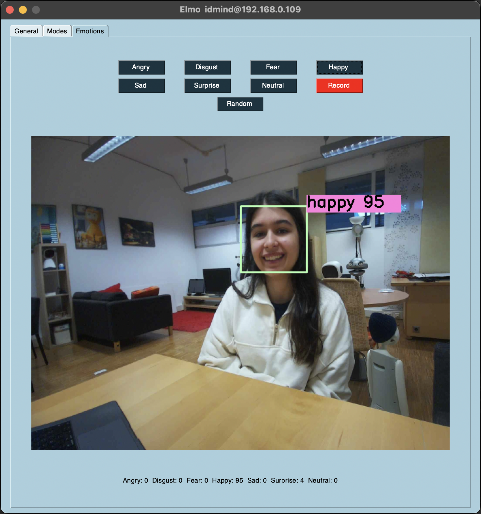

# 🤖 Elmo Robot – Emotions Demo App

This is a simple interface to play with the Elmo robot. You can control its head movement, show animations, and test emotion recognition. It’s great for quick demos, small experiments, or just having fun with Elmo’s expressions.

## 🎯 Overview

The app enables dynamic interaction with the Elmo robot through a simple GUI. Users can:

- Detect their facial expressions in real time.
- Receive visual and behavioral feedback from the robot.
- Control robot head movement (pan/tilt).
- Test their ability to perform emotional expressions via a record & mirror system.

## 🧩 Interface Overview

### 🔧 General Tab

- Control robot pan and tilt to orient its head.
- Toggle motors, blush effect, and behaviour.
- Preview the robot’s camera.
- Perform basic system checks before starting demos.

🎭 Modes Tab

- Select predefined expressions shown on the screen and LED matrix.
- Choose from animations like Fireworks, Heartbeat, and more.
- Select Random mode to let the robot express a random emotion.

😊 Emotions Tab

- Choose an emotion (like Happy, Sad, or Angry) and try to show that expression with your face. Elmo will try to detect your emotion and give you feedback:
  - If you match the selected emotion, Elmo shows a happy image and plays a positive sound.
  - If you don’t match, Elmo shows a crying image and plays a sound telling you to try again.
- You can also press Record to perform any expression freely—Elmo will detect it and mimic what it sees.
- Use Random mode to go through different emotions and test your performance one by one.

## ✨ Features

- 🧠 **Real-Time Emotion Detection**
  
  Powered by Residual Masking Network (RMN), the system classifies facial expressions in real time.

- 👁 **Expression Mirroring**

  Elmo mimics the user’s detected emotion with matching visuals and sounds.

- 🎨 **Visual & Audio Feedback**

  Emotions are displayed using Elmo’s LED matrix, screen animations, and sound effects that match each expression.

- 🎮 **Interactive Control Panel**

  Switch easily between tabs to control movement, change expressions, or test emotion detection.

- **📊 Performance Feedback**
  Get a confidence score for each recognized emotion, so you can see how well your expression was detected.


## 📦 Install Requirements

To install the necessary Python dependencies, run:

```bash
pip install -r requirements.txt
```


## 🚀 How to Run

### On the Client Side (GUI):

```bash
python src/elmo_app.py <elmoIP> <elmoPort> <clientIP>
```

### On the Robot Side:

```bash
python src/demos_handler.py <elmoIP> <elmoPort>
```

Replace the IPs and port with the appropriate network configuration.

## 📁 Files

- `src/elmo_app.py` – Main GUI  
- `src/emotions.py` – Emotion handling and feedback logic  
- `src/demos_handler.py` – Robot-side handler for screen, LED matrix, and movement control




